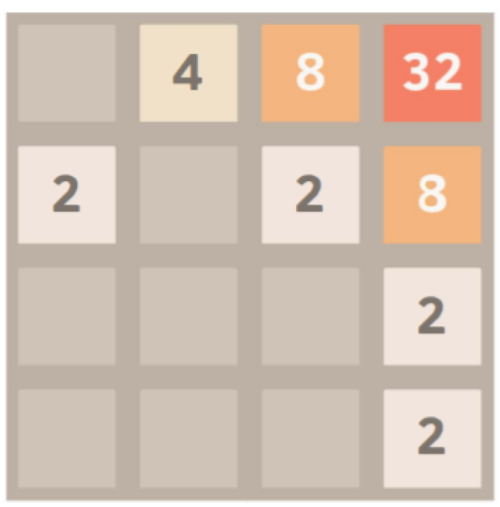

# Playing2048byRL
## Introduction
- Solving the game 2048 by RL related methods.
- 2048 is 4*4 grid game. Target is combining higher scores like 2048.

## Methods
- We try 3 main methods which are good at 2048, DQN, MCTS，NTN.
- DQN Algorithm

- MCTS Algorithm

- NTN Algorithm, good at chess game

## Results
- The total results are here:

- As for DQN, the results are:

- So we can get the maximum tile in dqn is:

- As for MCTS with DQN, the results are:

- So we can get the maximum tile in MCTS with DQN is:

- As for MCTS with NTN, the results are:

- So we can get the maximum tile in MCTS with NTN is:

## Codes Folder
- DQN for dqn
- mctsDQN for MCTS with DQN
- mctsNTN for MCTS with NTN
## NOTES
- Other details can be seen in "《强化学习理论及应用》课程大作业.pdf"
